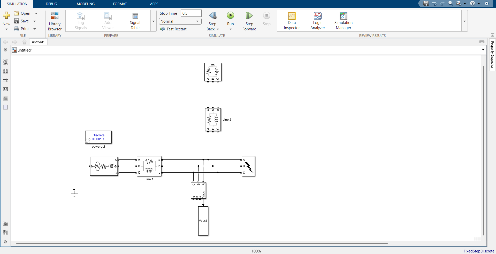
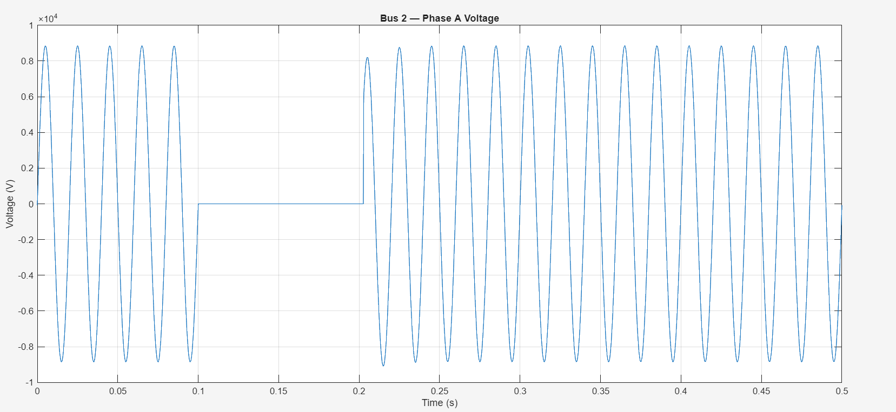
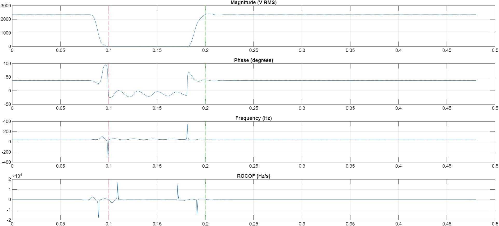
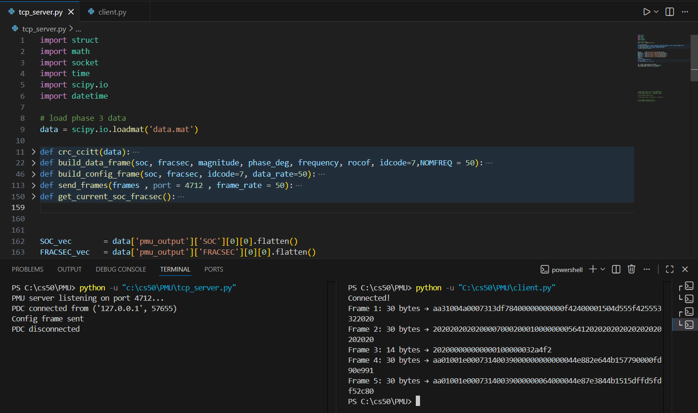
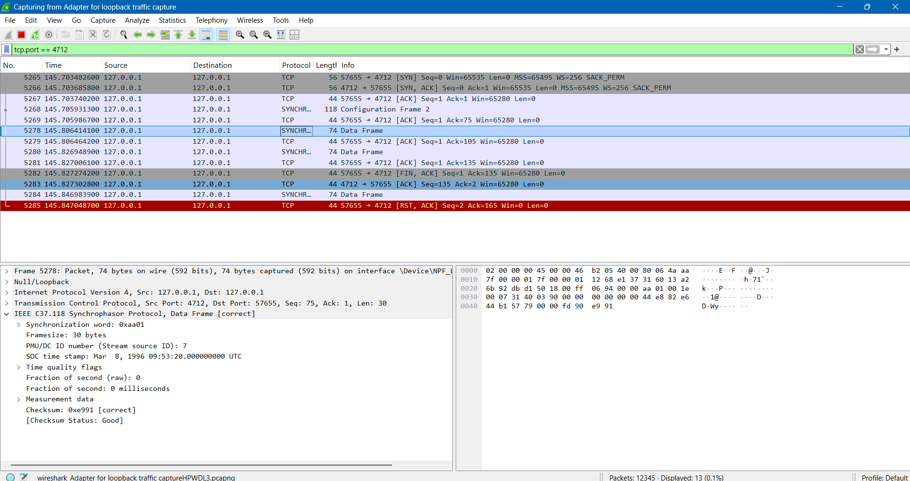
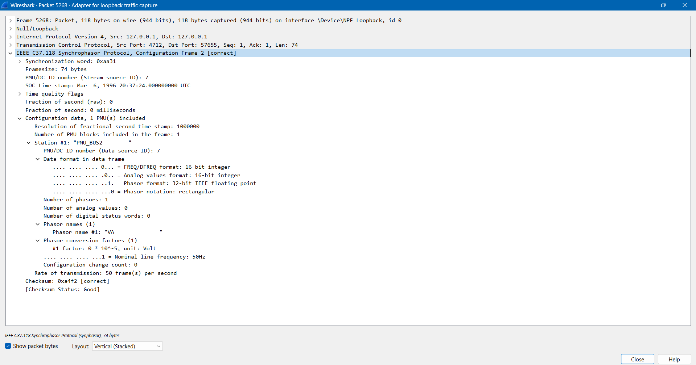
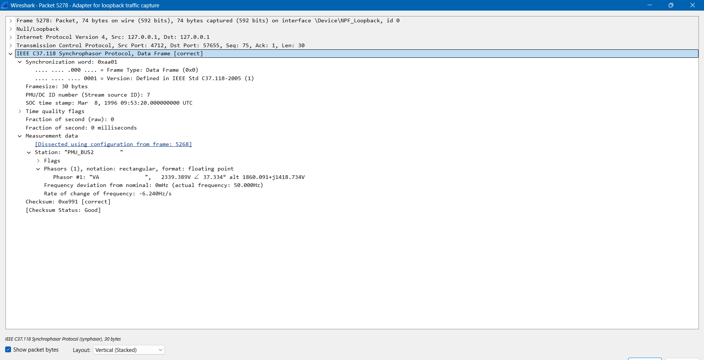
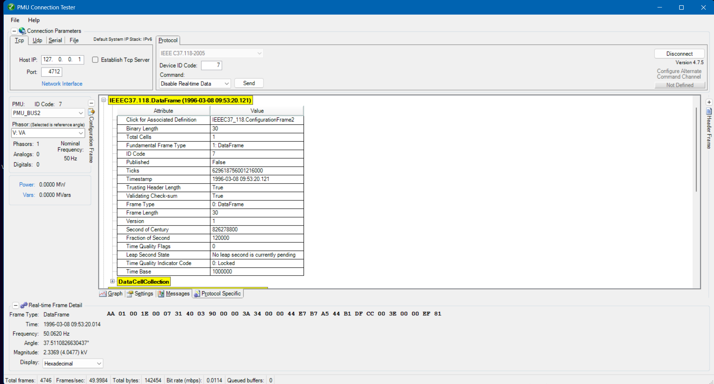
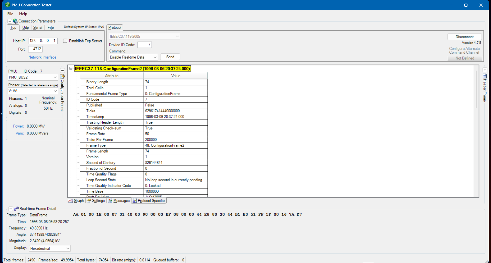
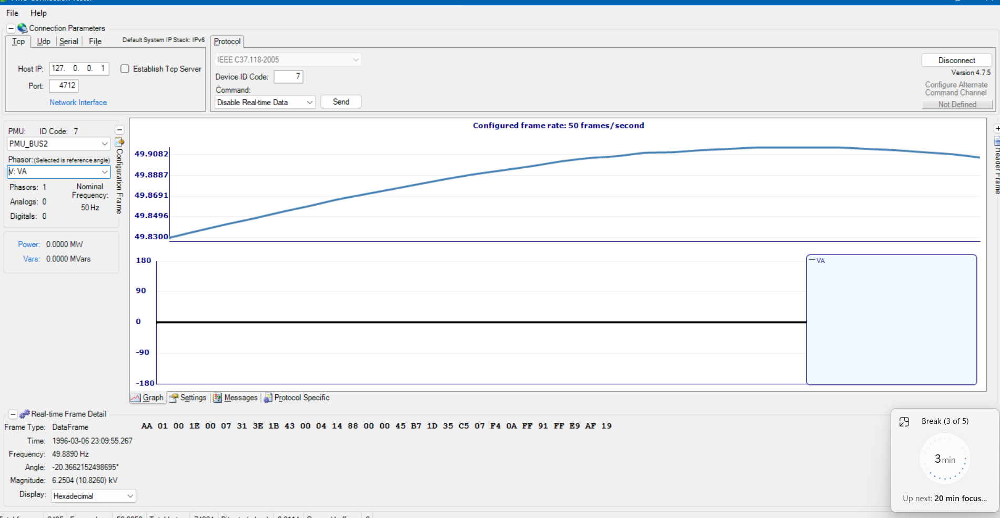

# Software-Defined PMU Platform

A complete implementation of a Phasor Measurement Unit (PMU) built from first principles, covering grid simulation, signal processing, IEEE C37.118-2005 protocol encoding, TCP streaming, and real-time validation against industry-standard tools.

**Author:** Ababaker  
**Standard:** IEEE C37.118-2005  
**Language:** MATLAB / Python  

---

## Project Overview

This project implements a full PMU pipeline across five phases, from raw voltage signal acquisition to a validated IEEE C37.118-2005 compliant data stream received by a professional PDC client.

```
Simulink Grid Model
      |
      v
PMU Signal Processor  (DFT-based phasor estimation)
      |
      v
Timestamp Engine      (UTC synchronization, SOC + FRACSEC)
      |
      v
C37.118 Frame Encoder (binary protocol implementation)
      |
      v
TCP Streaming Server  (PMU server, 50 frames/second)
      |
      v
Industry Validation   (Wireshark + PMU Connection Tester)
```

---

## Repository Structure

```
software-defined-pmu/
|
|-- simulation/               MATLAB and Simulink files
|   |-- grid.slx              Three-bus Simulink power system model
|   |-- run_pmu_estimator.m   DFT-based phasor, frequency, and ROCOF estimator
|   |-- to_timestamp.m        IEEE C37.118 UTC timestamp encoder (SOC + FRACSEC)
|   |-- main.m                Top-level script that runs all MATLAB phases
|
|-- protocol/                 Python files
|   |-- tcp_server.py         IEEE C37.118 PMU TCP server with Config and Data frames
|   |-- client.py             Test PDC client for frame reception and CRC verification
|   |-- data.mat              Exported MATLAB phasor data loaded by the TCP server
|
|-- docs/
    |-- images/               All verification and output screenshots
```

---

## Phase 1 — Power Grid Simulation

A three-bus power system modelled in Simulink using Simscape Electrical. The model includes a three-phase fault injected at Bus 2 between t = 0.1s and t = 0.2s.

**Topology:**

```
Source 1 --> Line 1 --> Bus 2 --> Line 2 --> Bus 3
                          |                    |
                        Fault               Load
                      V-I Meas
                          |
                        Vbus2
```

**Simulink Model:**



**Bus Voltage Waveform with Fault:**



Bus 2 voltage collapses to zero during the fault period and recovers cleanly after fault clearance at t = 0.2s.

---

## Phase 2 — PMU Signal Processor

A sliding-window DFT estimator implemented in `run_pmu_estimator.m`. Extracts phasor magnitude, phase angle, frequency, and ROCOF from the raw three-phase voltage signal.

**Key parameters:**

```
Sampling rate:   10,000 Hz
Window length:   N = 200 samples (one cycle at 50 Hz)
Window type:     Hanning with amplitude correction factor
Frequency:       Phase derivative method with cycle-to-cycle wrapping
ROCOF:           Smoothed derivative of frequency (movmean, 30-cycle window)
```

**PMU Estimator Output (magnitude, phase, frequency, ROCOF):**



---

## Phase 3 — UTC Timestamp Engine

`to_timestamp.m` converts simulation time to IEEE C37.118-compliant UTC timestamps.

```
SOC     = seconds since 1 January 2000 UTC  (uint32)
FRACSEC = fractional second * TIME_BASE     (uint32, TIME_BASE = 1,000,000)
```

Rollover handling is implemented for FRACSEC values at the one-second boundary. Phase error analysis confirmed compliance with the 31.8 microsecond timing budget corresponding to the 1% TVE boundary defined in IEEE C37.118-2005.

---

## Phase 4 — IEEE C37.118 Frame Encoder

`tcp_server.py` implements the complete C37.118-2005 binary frame structure in Python using `struct.pack` with big-endian encoding throughout.

**Data Frame structure (30 bytes):**

```
SYNC      2 bytes   0xAA01
FRAMESIZE 2 bytes   30
IDCODE    2 bytes   Station ID
SOC       4 bytes   Seconds of century
FRACSEC   4 bytes   Quality flags + fractional second
STAT      2 bytes   Status flags
PHASOR    8 bytes   Real + imaginary as 32-bit IEEE 754 floats
FREQ      2 bytes   Frequency deviation in millihertz (int16)
DFREQ     2 bytes   ROCOF * 100 (int16)
CHK       2 bytes   CRC-CCITT (polynomial 0x1021, seed 0xFFFF)
```

**Configuration Frame 2 structure (74 bytes):**

```
SYNC, FRAMESIZE, IDCODE, SOC, FRACSEC
TIME_BASE = 1,000,000
NUM_PMU   = 1
STN       = "PMU_BUS2" (16 bytes, ASCII padded)
FORMAT    = 0x0002 (float phasors, integer FREQ/DFREQ, rectangular)
PHNMR     = 1
CHNAM     = "VA" (16 bytes, ASCII padded)
PHUNIT    = 0x00000000
FNOM      = 0x0001 (50 Hz)
DATA_RATE = 50
CHK       = CRC-CCITT
```

All 4,801 frames passed CRC verification. Zero encoding errors.

---

## Phase 5 — TCP Streaming and Protocol Validation

The PMU server streams frames at 50 frames per second over TCP on port 4712 using deadline-based timing. Nagle's algorithm is disabled via `TCP_NODELAY` to ensure immediate frame transmission.

**Connection sequence:**

```
PDC connects
   |
   v
Server sends Configuration Frame 2 immediately
   |
   v
Server streams Data Frames continuously at 50 fps
```

**TCP server and test client running simultaneously:**



---

### Wireshark Validation

Captured on the loopback adapter with display filter `tcp.port == 4712`. The Wireshark SYNCHROPHASOR dissector decoded all frames correctly with no malformed packets.

**Packet capture showing SYNCHROPHASOR frames:**



**Configuration Frame 2 decoded:**



**Data Frame decoded:**



All frames showed `Checksum Status: Good`.

---

### PMU Connection Tester Validation

Connected using IEEE C37.118-2005 over TCP to `127.0.0.1:4712`. The tool successfully received the configuration frame and decoded live data frames at 49.9984 frames per second.

**Data Frame field-level inspection:**



Key fields confirmed:
```
Frame Type:           DataFrame
Frame Length:         30 bytes
ID Code:              7
Validating Checksum:  True
Time Base:            1,000,000
Frame Rate:           50 fps
Version:              1 (IEEE C37.118-2005)
```

**Configuration Frame 2 field-level inspection:**



Key fields confirmed:
```
Frame Type:    ConfigurationFrame2
Frame Length:  74 bytes
ID Code:       7
Frame Rate:    50
Time Base:     1,000,000
Version:       1 (IEEE Std C37.118-2005)
```

**Live frequency waveform display:**



The frequency plot correctly captures the fault-period deviation and post-fault recovery, confirming end-to-end data integrity from the Simulink model through to the PDC client.

---

## Dependencies

**MATLAB:**
```
MATLAB R2022a or later
Simulink
Simscape Electrical
Signal Processing Toolbox
```

**Python:**
```
Python 3.8 or later
scipy
numpy
struct  (standard library)
socket  (standard library)
```

Install Python dependencies:
```
pip install scipy numpy
```

---

## Running the Project

**Step 1: Run the Simulink simulation**
```
Open simulation/grid.slx in MATLAB
Run simulation (produces Vbus2 workspace variable)
Run simulation/main.m to execute phases 2, 3, and data export
This exports data.mat to the protocol folder
```

**Step 2: Start the PMU TCP server**
```
cd protocol
python tcp_server.py
```

**Step 3: Connect a PDC client**

Using the test client:
```
python client.py
```

Using PMU Connection Tester:
```
Protocol: IEEE C37.118-2005
Transport: TCP
Host:      127.0.0.1
Port:      4712
ID Code:   7
```

Using Wireshark:
```
Interface: Npcap Loopback Adapter
Filter:    tcp.port == 4712
```

---

## References

IEEE Std C37.118-2005, IEEE Standard for Synchrophasors for Power Systems.

A. G. Phadke and J. S. Thorp, Synchronized Phasor Measurements and Their Applications, Springer, 2008.

P. Kundur, Power System Stability and Control, McGraw-Hill, 1994.
